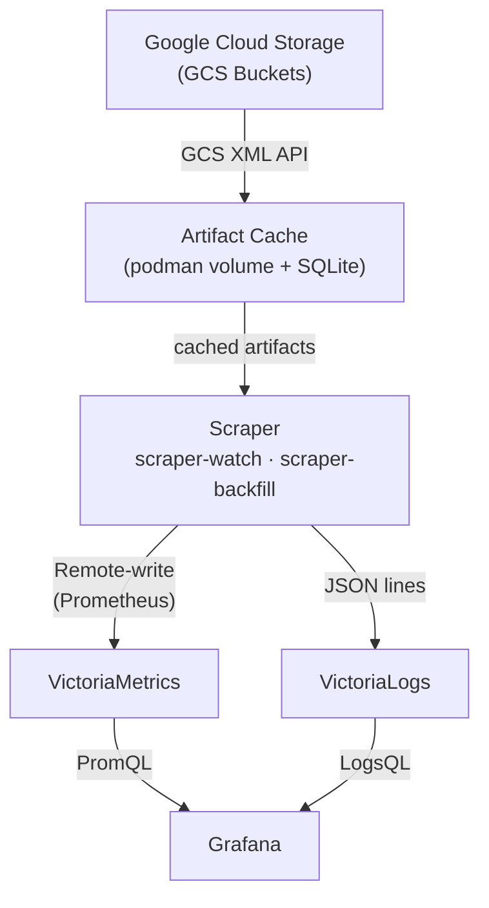

# Architecture

## System Diagram

## Data Flow

### Discovery

The scraper discovers CI builds for the configured `--repo` via the GCS XML API:

1. **PR Enumeration**: List prefixes under `gs://test-platform-results/pr-logs/pull/{org}_{repo}/`
2. **Job Enumeration**: Within each PR, list job directories
3. **Build Enumeration**: Within each job, list build directories
4. **Date Filtering**: Read `started.json` from each build to filter by the `--window` range
5. **Artifact Processing**: For each qualifying build, run all registered pipelines

### Metric Conversion

Metrics are converted to Prometheus text exposition format:

- **Generic Extraction**: All numeric fields are automatically extracted as metrics
- **Known Transforms**: Nanosecond values converted to seconds, Kubernetes quantities parsed to numeric values
- **Canonical Aliases**: Common metric names are normalized (e.g., `duration_ns` -> `duration_seconds`)

### Log Ingestion

The scraper fetches `ci-operator.log` from each build's artifact directory. Each JSON line is parsed independently:

- **Time and message** are extracted as `_time` and `_msg` fields
- **Scalar fields** (level, component, etc.) are flattened into the log entry
- **Job labels** from `ci-operator-metrics.json` are merged into each entry for consistent queryability across metrics and logs

## Scraper Internals

### Pipeline Architecture

Each pipeline processes a specific artifact type and emits records to a sink:

| Pipeline | Artifact | Output | Sink |
|---|---|---|---|
| MetricsPipeline | `ci-operator-metrics.json` | Prometheus metrics | VictoriaMetrics |
| LogPipeline | `ci-operator.log` | JSON log lines | VictoriaLogs |
| JunitPipeline | `junit_operator.xml`, `junit_*.xml` | Metrics + failure logs | Both |
| ClusterPoolPipeline | `clusterClaim.json`, `clusterDeployment.json` | Pool lifecycle metrics | VictoriaMetrics |
| TestClusterMetricsPipeline | [`prometheus.tar`](docs/appendix/prometheus-tsdb-artifacts.md#prometheustar-tsdb-dump), [`cluster-health-metrics.txt`](docs/appendix/prometheus-tsdb-artifacts.md#cluster-health-metricstxt-health-check-metrics) | Cluster utilization metrics | VictoriaMetrics |
| StepGraphPipeline | `ci-operator-step-graph.json` | Config hash metric + per-step logs | Both |
| BuildResourcesPipeline | Kubernetes resource JSONs | Event/pod/deployment logs | VictoriaLogs |

Pipelines are independent -- each receives a `BuildContext` and decides what to fetch and emit. Each pipeline declares a `version` string; bumping it causes reprocessing for that pipeline only.

**Test cluster metrics** come from two sources with different instrumentation requirements:

- **`prometheus.tar`** is produced automatically by the OpenShift CI [gather-extra step](https://docs.ci.openshift.org/) -- jobs that provision a test cluster and include a gather step get this for free. The scraper runs `promtool tsdb dump` to extract utilization metrics from the TSDB.
- **`cluster-health-metrics.txt`** is a project-implemented collector that runs inside the e2e test binary and writes Prometheus exposition format to `$ARTIFACT_DIR`. It's cheaper to process and can include custom signals (e.g., `cluster_healthy`), but requires each project to build the collector. See [opendatahub-io/opendatahub-operator#3316](https://github.com/opendatahub-io/opendatahub-operator/pull/3316) for a reference implementation.

Both are documented in detail in [docs/appendix/prometheus-tsdb-artifacts.md](docs/appendix/prometheus-tsdb-artifacts.md).

### Core Entities

- **GCSClient**: Pure HTTP client for the GCS XML API.

- **ArtifactCache**: On-disk cache backed by SQLite metadata. Handles artifact caching, miss tracking, processed output, staging for large temporary files, and age-based cleanup.

- **CachedGCSClient**: Composes `GCSClient` + `ArtifactCache` for transparent cache-aware fetching.

- **ScrapeState**: SQLite-backed pipeline processing state with retry tracking.

- **BuildContext**: Per-build facade providing lazy artifact fetching and job label extraction.

- **Scraper**: Orchestrator that discovers builds, checks processing state, and runs pipelines via a thread pool.

### Concurrency

The scraper uses a `ThreadPoolExecutor` shared by discovery and build processing. Discovery and build processing tasks interleave as they complete. The TestClusterMetricsPipeline runs `promtool` WAL replay in a separate pool (configurable via `PROMTOOL_WORKERS`) to avoid starving the main pool with CPU-intensive work. WAL size is checked before submission -- tars exceeding `MAX_WAL_MB` are skipped to prevent OOM.

### Artifact Cache

GCS artifacts are immutable, so the scraper caches fetched objects to a podman volume shared between watch and backfill services. Cache metadata (misses, build timestamps) is stored in SQLite (`cache.db`). The TestClusterMetricsPipeline caches processed promtool output as `.metrics` files with version headers to avoid redundant WAL replay.

Temporary large files (prometheus.tar) are downloaded to a staging directory that is wiped at init for crash recovery. Age-based cleanup queries SQLite for expired builds rather than walking the filesystem.

## Operational Modes

The scraper runs as two compose services sharing the same cache volume:

- **scraper-watch**: Continuously polls GCS for new builds. Runs indefinitely.
- **scraper-backfill**: Processes historical builds within the configured `--window`. Exits when complete.

## State Management

Pipeline processing state is tracked in SQLite (`state.db`) via `ScrapeState`. A build is skipped if all pipelines have processed it at their current version. Failed builds are retried up to a configurable maximum (default 3), then permanently skipped. Success is a terminal state that cannot be reverted by a concurrent failure.

- **Selective reprocessing**: bumping a pipeline's version reprocesses only that pipeline
- **Idempotency**: reprocessed builds are deduplicated by VictoriaMetrics
- **`make wipe-db`**: clears VM/VL data and `state.db` (triggers re-ingestion from cache)
- **`make wipe-cache`**: clears the cache volume
- **`make wipe-all`**: clears everything

## Deduplication

VictoriaMetrics deduplicates samples with identical timestamps and labels. Log entries include a `pipeline` field; when a pipeline version changes, old log entries are deleted before re-pushing.

## Portability

The scraper outputs standard Prometheus text format (metrics) and JSON lines (logs). Migration to hosted observability platforms requires only changing the ingestion URL and adding authentication.
