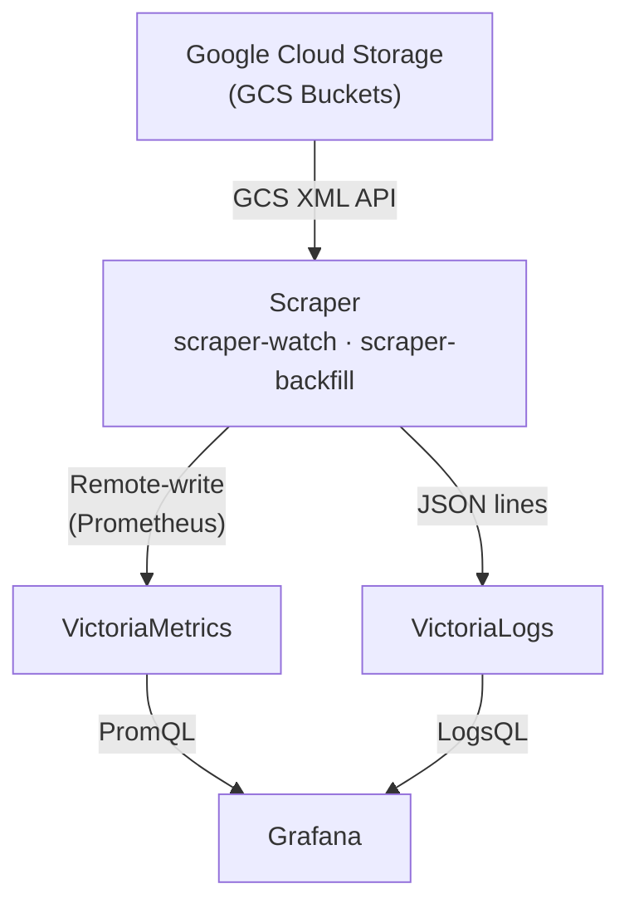

# Architecture

## System Diagram

## Data Flow

### Discovery

The scraper discovers CI builds for a specific repo via the GCS XML API:

1. **PR Enumeration**: List prefixes under `gs://test-platform-results/pr-logs/pull/{org}_{repo}/` (derived from the `--repo` flag)
2. **Job Enumeration**: Within each PR, list job directories
3. **Build Enumeration**: Within each job, list build directories
4. **Date Filtering**: Read `started.json` from each build to filter by the `--window` range
5. **Artifact Processing**: For each qualifying build, run registered pipelines (metrics, logs) against the build's artifacts

### Metric Conversion

Metrics are converted to Prometheus text exposition format:

- **Generic Extraction**: All numeric fields are automatically extracted as metrics
- **Known Transforms**:
  - Nanosecond values converted to seconds
  - Kubernetes quantities (e.g., `1Gi`, `500m`) parsed to numeric values
- **Canonical Aliases**: Common metric names are normalized (e.g., `duration_ns` -> `duration_seconds`)

Metrics are pushed to VictoriaMetrics via remote-write protocol.

### Log Ingestion

The scraper fetches `ci-operator.log` from each build's artifact directory. This file contains structured JSON lines emitted by the ci-operator process during execution. Each line is parsed independently:

- **Time and message** are extracted as `_time` and `_msg` fields
- **Scalar fields** (level, component, and other string/numeric/bool values) are flattened into the log entry
- **Job labels** from the build's `ci-operator-metrics.json` are merged into each log entry, providing consistent queryability across metrics and logs. Labels take precedence over log fields with the same name.

Logs are pushed to VictoriaLogs as JSON lines with `_stream_fields=job_name,build_id`.

## Domain Model

The scraper is built around a pipeline architecture with four core entities:

- **Pipeline**: A named processor that takes a `BuildContext` and produces records for a sink. Each pipeline targets a specific artifact (e.g., `MetricsPipeline` processes `ci-operator-metrics.json`, `LogPipeline` processes `ci-operator.log`). Adding a new scrape target means writing a new Pipeline and registering it in the CLI wiring.

- **Sink**: A destination for records. Sinks handle batching and HTTP transport. `VictoriaMetricsSink` pushes Prometheus text format to VictoriaMetrics. `VictoriaLogsSink` pushes JSON lines to VictoriaLogs.

- **BuildContext**: A per-build facade that provides lazy artifact fetching (with caching) and label extraction. Pipelines access build artifacts and job labels through the context without needing to know about GCS paths or label parsing.

- **Scraper**: The orchestrator that discovers builds via GCS, filters by date range, skips builds already in VictoriaMetrics, creates a `BuildContext` for each qualifying build, and runs all registered pipelines. Pipeline failures are caught per-pipeline so all pipelines get a chance to run.

Components are composed at startup: the CLI creates a session, GCS client, sinks, pipelines, and scraper, then calls `scraper.scrape()`.

## Portability Design

The scraper outputs data in standard formats:

- **Metrics**: Prometheus text exposition format
- **Logs**: JSON lines

This design enables migration to hosted observability platforms by changing the ingestion URL and adding authentication, without modifying the scraper's output format.

## Deduplication Strategy

### Metrics

VictoriaMetrics handles deduplication via `-dedup.minScrapeInterval=1ms` flag, which deduplicates samples with identical timestamps and labels.

### Logs

The scraper skips builds already present in VictoriaMetrics (see State Management below). Metrics deduplication handles any rare duplicate processing from concurrent scraper instances.

## Operational Modes

The scraper runs as two compose services:

### scraper-watch (Continuous Polling)

- Continuously polls GCS for new builds
- Runs indefinitely
- Processes builds as they appear
- Intended for real-time monitoring

### scraper-backfill (One-Time)

- Processes builds within the configured `--window`
- Exits when complete
- Used for historical data ingestion
- Activated via compose profiles: `podman-compose --profile backfill up -d`

## State Management

Build processing state is stored in VictoriaMetrics itself. The scraper queries for known `build_id` values at the start of each cycle and pushes a `ci_build_scraped` sentinel metric after processing each build. This means:

- **No external state**: no state file, no shared volume between scraper instances
- **Self-healing**: if VictoriaMetrics data is wiped, builds are automatically re-ingested
- **Idempotency**: builds can be reprocessed safely; VictoriaMetrics deduplicates identical data points
