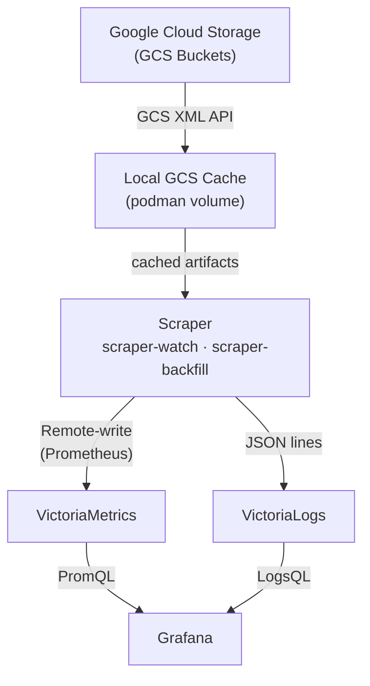

# Architecture

## System Diagram

## Data Flow

### Discovery

The scraper discovers CI builds for a specific repo via the GCS XML API:

1. **PR Enumeration**: List prefixes under `gs://test-platform-results/pr-logs/pull/{org}_{repo}/` (derived from the `--repo` flag)
2. **Job Enumeration**: Within each PR, list job directories
3. **Build Enumeration**: Within each job, list build directories
4. **Date Filtering**: Read `started.json` from each build to filter by the `--window` range
5. **Artifact Processing**: For each qualifying build, run registered pipelines (metrics, logs) against the build's artifacts

### Metric Conversion

Metrics are converted to Prometheus text exposition format:

- **Generic Extraction**: All numeric fields are automatically extracted as metrics
- **Known Transforms**:
  - Nanosecond values converted to seconds
  - Kubernetes quantities (e.g., `1Gi`, `500m`) parsed to numeric values
- **Canonical Aliases**: Common metric names are normalized (e.g., `duration_ns` -> `duration_seconds`)

Metrics are pushed to VictoriaMetrics via remote-write protocol.

### Log Ingestion

The scraper fetches `ci-operator.log` from each build's artifact directory. This file contains structured JSON lines emitted by the ci-operator process during execution. Each line is parsed independently:

- **Time and message** are extracted as `_time` and `_msg` fields
- **Scalar fields** (level, component, and other string/numeric/bool values) are flattened into the log entry
- **Job labels** from the build's `ci-operator-metrics.json` are merged into each log entry, providing consistent queryability across metrics and logs. Labels take precedence over log fields with the same name.

Logs are pushed to VictoriaLogs as JSON lines with `_stream_fields=job_name,build_id`.

## Scraper Internals

### Pipeline Architecture

The scraper is built around a pipeline architecture. Each pipeline processes a specific artifact type and emits records to a sink:

| Pipeline | Artifact | Output | Sink |
|---|---|---|---|
| MetricsPipeline | `ci-operator-metrics.json` | Prometheus metrics | VictoriaMetrics |
| LogPipeline | `ci-operator.log` | JSON log lines | VictoriaLogs |
| JunitPipeline | `junit_operator.xml`, `junit_*.xml` | Metrics + failure logs | Both |
| ClusterPoolPipeline | `clusterClaim.json`, `clusterDeployment.json` | Pool lifecycle metrics | VictoriaMetrics |
| TestClusterMetricsPipeline | `prometheus.tar` (TSDB dump) | Cluster utilization metrics (per-node metrics enriched with master/worker `role` label) | VictoriaMetrics |

Adding a new scrape target means writing a new Pipeline class and registering it in `__main__.py`. Pipelines are independent -- each receives a `BuildContext` and decides what to fetch and emit.

### Core Entities

- **BuildContext**: Per-build facade providing lazy artifact fetching (with in-memory caching) and job label extraction. Pipelines access build artifacts and labels through the context without needing to know about GCS paths.

- **Sink**: Handles batching and HTTP transport to backend services. `VictoriaMetricsSink` pushes Prometheus text format, `VictoriaLogsSink` pushes JSON lines.

- **GCSClient**: HTTP client for the GCS XML API with optional filesystem cache. Listing operations (PR/job/build enumeration) are never cached; object fetches are cached on disk so re-ingestion after a DB wipe reads from local disk.

- **Scraper**: Orchestrator that discovers builds, filters by date range, skips already-processed builds, and runs all pipelines via a thread pool.

### Concurrency

The scraper uses a `ThreadPoolExecutor` to process builds in parallel. Discovery (listing PRs, jobs, builds from GCS) runs on the main thread and submits builds to the pool as they're discovered. All builds across all PRs and jobs share the pool, so workers stay saturated even when individual builds take varying amounts of time (e.g., prometheus.tar extraction is much slower than JSON parsing).

### GCS Artifact Cache

GCS artifacts are immutable once written, so the scraper caches fetched objects to a local directory (a podman volume shared between watch and backfill services). Cache entries use the GCS path as the filesystem path, mirroring the bucket layout. 404 responses are cached as `.miss` marker files to avoid re-probing missing artifacts.

`make wipe-db` clears the database but preserves the cache, enabling fast re-ingestion after scrape logic changes. `make wipe-all` clears both.

## Portability Design

The scraper outputs data in standard formats:

- **Metrics**: Prometheus text exposition format
- **Logs**: JSON lines

This design enables migration to hosted observability platforms by changing the ingestion URL and adding authentication, without modifying the scraper's output format.

## Deduplication Strategy

### Metrics

VictoriaMetrics handles deduplication via `-dedup.minScrapeInterval=1ms` flag, which deduplicates samples with identical timestamps and labels.

### Logs

The scraper skips builds already present in VictoriaMetrics (see State Management below). Metrics deduplication handles any rare duplicate processing from concurrent scraper instances.

## Operational Modes

The scraper runs as two compose services:

### scraper-watch (Continuous Polling)

- Continuously polls GCS for new builds
- Runs indefinitely
- Processes builds as they appear
- Intended for real-time monitoring

### scraper-backfill (One-Time)

- Processes builds within the configured `--window`
- Exits when complete
- Used for historical data ingestion
- Activated via compose profiles: `podman-compose --profile backfill up -d`

## State Management

Build processing state is stored in VictoriaMetrics itself. The scraper queries for known `build_id` values at the start of each cycle and pushes a `ci_build_scraped` sentinel metric after processing each build. This means:

- **No external state**: no state file, no shared volume between scraper instances
- **Self-healing**: if VictoriaMetrics data is wiped, builds are automatically re-ingested
- **Idempotency**: builds can be reprocessed safely; VictoriaMetrics deduplicates identical data points
